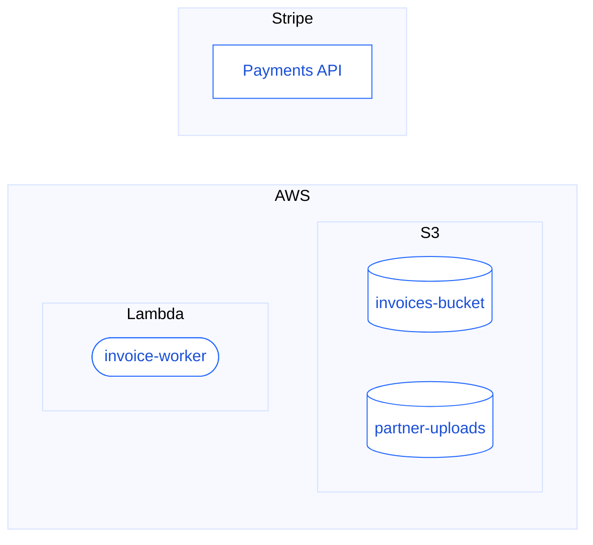

Every system interacts with multiple external parties. These can be a cloud provider, a payment processor or an AI vendor, but also suppliers, customers and other business partners. Which integration points exist with each of them, as part of which flows, and for what purpose, are often difficult questions to answer. But they are key to understand failures in a critical path, to review compliance, and to scope the replacement of a provider.

The model records those integration points as counterparties.

## What a counterparty is

A counterparty is an external technical component that the system interacts with. Examples of counterparties are a specific S3 bucket, a Lambda function, the Stripe API, or an FTP server at a partner.

A single counterparty can be called from multiple places across multiple applications. The model holds which services call a counterparty, what those calls send, and which business operations sit behind them. A provider outage can be scoped to the flows it stops, and a vendor review can name the data each integration carries.

Calls to the organization's own services are not counterparties.

## How counterparties are grouped

A counterparty names one concrete component. A large organization can have hundreds of them. Groups collect those components into the parties behind them, in two kinds.

| Group | Collects | Examples |
| --- | --- | --- |
| **Technical group** | Counterparties operated by a technology provider | AWS, S3, Stripe, an AI vendor |
| **Business group** | Counterparties belonging to an organization the company deals with | a supplier, a customer, a partner bank |

The two kinds are not exclusive, and a counterparty usually belongs to several groups. An S3 bucket sits in the S3 and AWS technical groups. A bucket that holds a customer's data also sits in that customer's business group, and the calls that reach it are then visible from both readings of the inventory.

## Where the grouping comes from

Technical groups follow from the provider and the service behind each call. Business groups are built from what the model knows about the flows those calls belong to, and the context in which they are made.

<Info>
  **Example.** A flow exports the tax movements of a period and uploads the file to an S3 bucket. The model holds the data leaving the system, the operation that produced it, and the code performing the upload. That context identifies the bucket as the one belonging to the company's tax advisors, and places it in their business group next to everything else exchanged with them.
</Info>

Names and groups are inferred. [Counterparty curation](/data-curation/counterparties) covers renaming a counterparty, merging variants of the same one, and changing the groups it belongs to.
