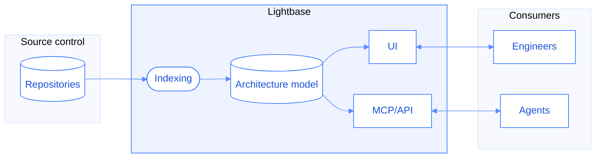

Indexer reads the code in the connected repositories and builds a model of every service, the entrypoints that start work in it, and everything that work reaches. This page describes how that model is produced, and what each part of it is derived from.

## How indexing runs

The first run indexes a repository completely, which can take a couple of hours in very large codebases. Changes to a repository then trigger incremental runs that update only what has changed, so the model holds the most recent state of the code.

Incremental runs happen once a day, for the repositories that have changes in them. Indexing on every commit is available on request.

Indexed results are stored per organization. [Code storage](/security/security-model) describes how they are protected.

## What Indexer finds in a repository

Indexing begins with the connected repositories. It identifies the services in each one from files like `go.mod`, `pom.xml`, or a `package.json` with a start script. Repositories can yield one service or more, especially monorepos, and each service is analyzed separately.

In some cases this heuristic leads to incorrect boundaries. They can be adjusted in [Application management](/data-curation/applications).

## Where a code flow starts

Analysis starts at the entrypoints of a service: its HTTP routes, queue consumers, gRPC methods, scheduled jobs and CLI commands. Indexer identifies the entrypoints to a service and reconstructs their HTTP routes or topics from the frameworks and libraries that declare them.

From there it follows the calls the code makes, one function to the next, until the work completes. The path it traces, from the entrypoint to everything it reaches, is a code flow. A service has one flow per entrypoint.

A call to another service, a publish to a topic or an invocation of a function continues in the code that handles it. A single flow can run through several services.

## What a flow reaches

While traversing a flow, Indexer records every interaction that leaves the process:

- **Database access**, with the tables involved, whether the access reads or writes, and the code that performs it.
- **Calls to other services in the organization**, resolved onto the entrypoint they invoke.
- **Message queues**, both the topics a flow publishes to and the ones it consumes.
- **Counterparties**, the external entities behind a call, such as Stripe, Twilio, or an S3 bucket.
- **File access** performed by the code.

Each interaction is recorded against the flow that reached it. It becomes possible to ask which operations write to `payment_intents`, which endpoints reach Stripe, or which services a column rename affects.

For databases, Indexer also reconstructs the schema described in the source.

<Accordion title="How a schema is reconstructed without a DDL">
  Indexer reads ORM and ODM models, raw SQL, data access classes and connection configuration, and combines them into the tables and columns they describe.

  Some information might not be recoverable from the code alone. The hostname of a database, for example, is often passed as an environment variable, and Indexer keeps the name of that variable.

  An authoritative schema can be supplied through [DDL upload](/data-curation/databases). Those tables are then defined by it.
</Accordion>

## How service-to-service calls are resolved

Each outgoing call made by a service is extracted and matched to the correct entrypoint in the receiving service.

| Transport | Extracted from the call | Matched against |
| --- | --- | --- |
| HTTP | Target host, verb and route, normalized | The route patterns declared in the receiving service |
| Message queues | Host, topic and shape of the message | The consumers of that queue |

As with database extraction, not all of the necessary information is mechanically recoverable from the code. Indexer uses multiple layers of matching to establish the correct target, including semantic information about each candidate.

## What is exact and what is inferred

Indexer extracts most information deterministically, through static code analysis and framework integrations. It also builds on LLMs for narrow tasks, to produce semantic information or improve its matching capabilities. [Data curation](/data-curation/overview) provides control over the data that was inferred.

| In the model | Where it comes from | How it is established |
| --- | --- | --- |
| Services | The build and dependency files in a repository | **Inferred** |
| Entrypoints and their routes | The declarations made by the framework or library | **Exact** |
| Code flows | The calls an entrypoint makes, resolved to the functions they run | **Exact** |
| Table access, read or write | ORM models, SQL, and data access code along the flow | **Exact** where the source names the table |
| Database schemas | Models, queries, and configuration, or an uploaded DDL | **Exact** from a DDL, reconstructed otherwise |
| Calls between services | The host, verb and route at both ends | **Exact** where the match is unambiguous, otherwise inferred |
| Queue links | The host, topic and message shape at both ends | **Exact** where the match is unambiguous, otherwise inferred |
| Counterparties and their groups | The destination of each external call | **Inferred** |
| Business entities | The tables and flows that share a concept | **Inferred** |
