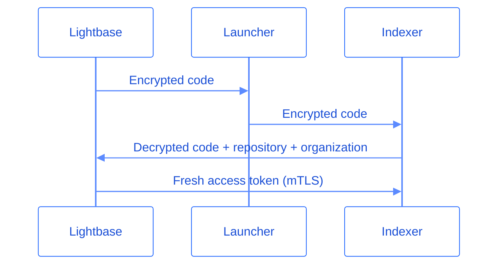

Lightbase reads your source code to build a model of your system and answer questions about it. Granting that access is a security decision, so Lightbase applies controls at every step of the process.

This page follows that process in order: the access tokens Lightbase uses and when it stores them, the isolated environments where indexing runs, how the indexer obtains a token to clone your code, how the resulting model and graph data are encrypted, and how that data is deleted when you revoke access.

## Access tokens

Lightbase uses access tokens from your connected source providers to:

- List the repositories available for that token during synchronization
- Read repository metadata such as branches and commits
- Fetch your code during indexing

How Lightbase manages these tokens depends on the source provider.

### GitHub connections

Lightbase accesses your repositories through the Lightbase GitHub App, which links to your organization rather than a single user account. We store each GitHub App installation access token using envelope encryption. Internally, we manage a single Customer Master Key (CMK) stored as a secret and used to encrypt the per-organization Data Encryption Keys (DEK). The DEK is used to encrypt the stored access token and refresh token on demand. Access tokens have a one-hour expiration set by GitHub. All encryption is performed using AES128-CBC.

### GitLab and Bitbucket connections

GitLab and Bitbucket repositories connect to a user account through OAuth, brokered by WorkOS. WorkOS holds the authorization and manages the storage and refresh of the tokens. Lightbase stores no token, instead it requests a short-lived token from WorkOS each time it needs one.

## Indexing environment

To build your model, Lightbase clones each repository and analyzes its code. Each indexing run happens in its own fresh environment, and nothing carries over to the next.

- **Secure by design.** Each analysis runs in a sandboxed container on gVisor with tightly controlled flags and no shared storage.
- **Isolated.** Containers are isolated from each other, with no public IP, no Internet access, and with controlled API accesses. No other indexing run, organization, or outside party can reach an active container.
- **One repository per run.** A container only ever holds the repository it was created to analyze.
- **Ephemeral by design.** Your code exists in the environment only while the run is active. Once the run completes, the container is destroyed.

## Indexing process

The indexing process is designed to access your code safely and to ensure only encrypted information leaves its boundaries. Each organization gets a separate encryption key used only for indexing-related information, created and managed inside Google KMS. In addition to the encryption key, each indexing run needs the source provider's access token to clone the repository, which it obtains through a one-time exchange:

1. Lightbase triggers an indexing run. It generates a one-time code for the repository, stores it, and encrypts it with your organization's encryption key.
2. It enqueues a message for the run, carrying the encrypted code and the repository's identifier. The message never carries the access token itself.
3. A job launcher consumes messages from the queue, initiates the containers, and forwards the job data.
4. When the indexing runs, it decrypts the code from the job to exchange it for a fresh access token in the Lightbase service. Identity is established through mTLS.
5. Lightbase matches the code against the one stored for that repository and consumes it. On a match, it requests a fresh access token from your provider and returns it to the indexer.

<Note>
    The code in the job is encrypted with your organization's key, so it cannot be used without access to that key. Each code works only once, and the exchange runs over mTLS, so a captured code cannot be replayed.
</Note>

## Model and graph data

Indexing produces the model Lightbase builds from your code, stored in a combination of graph and vector representations, holding embeddings, encrypted code snippets, and metadata that let you and your agents query how your services connect. Lightbase encrypts this data with your organization's key and keeps it isolated to your organization.

## Data deletion

You stay in control of the data Lightbase derives from your code.

When you [disable a repository](/getting-started/repositories), remove it from your provider, or revoke Lightbase's access to it, Lightbase detects the change and deletes all model and graph data it produced for that repository. You can re-enable a repository at any time, but Lightbase indexes it from scratch, and the previous data is not restored.

Deleting your organization goes further. Lightbase destroys all the information and keys generated for your organization.
