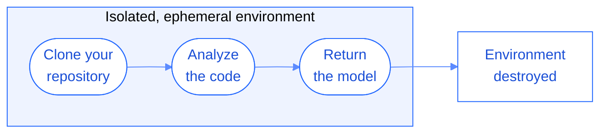

To build your model, Lightbase clones each repository and analyzes its code. That work runs in an isolated environment created for a single analysis and removed when it finishes.

## How each analysis runs

Every analysis runs in its own fresh environment. Lightbase creates it for one run, clones a single repository into it, analyzes the code, returns the model, and destroys the environment. Nothing carries over to the next analysis.

- **One repository per run.** An environment only ever holds the repository it was created to analyze.
- **Ephemeral by design.** Your code exists in the environment only while the analysis runs.
- **Least privilege.** The analysis runs as an unprivileged user, not as root.

## Isolation between analyses

No other analysis, organization, or outside party can reach an active analysis environment. Each analysis runs in its own isolated environment, with no shared storage and no network path to any other. Concurrent analyses of other repositories or organizations run in separate environments that cannot see or reach yours.

## Handling untrusted code

Lightbase treats every repository as untrusted input. When it clones your code, it disables git hooks, symlink materialization, and submodule fetching, so cloning a repository cannot trigger code execution or reach outside the repository being analyzed.

<Note>
  The environment holds your code only while the analysis runs. When the analysis finishes, Lightbase destroys the environment and your code goes with it. Lightbase keeps the model and the analysis results, encrypted with your organization's key. See [Code storage](/security/code-storage).
</Note>

## What's next

<Columns cols={2}>
  <Card title="Code storage" icon="shield-halved" href="/security/code-storage">
    See how Lightbase encrypts your model and results at rest.
  </Card>
  <Card title="How indexing works" icon="magnifying-glass-chart" href="/architecture/indexing-process">
    See what Lightbase produces when it analyzes your code.
  </Card>
</Columns>
