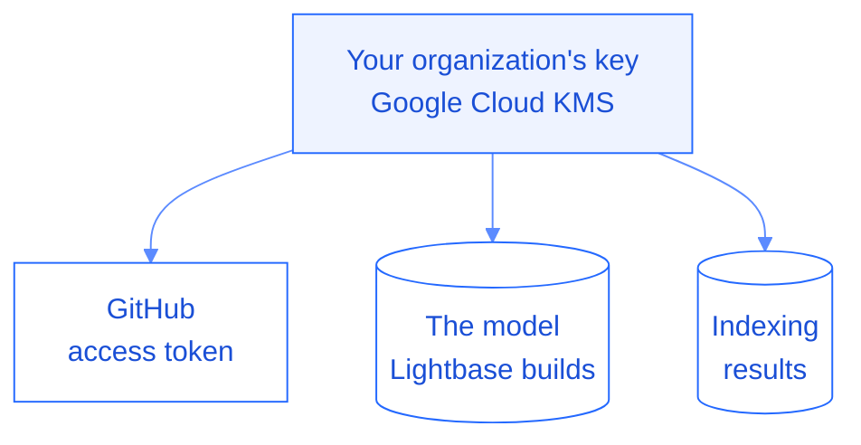
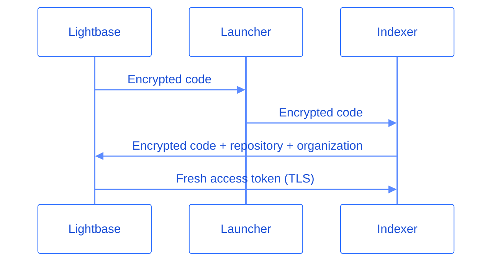

Lightbase holds three kinds of data on your behalf: the access token for your GitHub connection, the model it builds from your code, and the results of each indexing run.

Everything is encrypted in transit and at rest. At rest, each organization has its own dedicated encryption key in Google Cloud KMS, and that key encrypts all three. Your data and encryption keys are stored in the European Union.

## Encryption in transit

Every connection to and from Lightbase uses TLS: the calls to your source provider, the exchange that delivers an access token to the indexer, and the traffic to the MCP server at `https://mcp.lightbase.co`.

### Delivering the access token to the indexer

To clone a repository, the indexer needs an access token. Lightbase never puts that token in the indexing job or hands it to the launcher that starts the run. The token reaches the indexer through a one-time exchange, so it only ever exists inside Lightbase and on the indexer that clones your code.

1. When Lightbase starts an indexing run, it generates a one-time code for the repository, stores it, and encrypts it with your organization's key. The encrypted code travels to the indexer in place of the token.
2. The indexer sends the encrypted code back to a Lightbase endpoint, along with the repository and organization it is indexing.
3. Lightbase decrypts the code with your organization's key, matches it against the code stored for that repository, and consumes it. On a match, Lightbase requests a fresh access token from your provider and returns it over TLS.

The encrypted code is useless without your organization's key, which never leaves Lightbase. A code works only once, so a captured code cannot be replayed.

## Encryption at rest

Each organization has its own dedicated key in Google Cloud KMS. Lightbase encrypts everything it stores for you with that key, so your data stays isolated from every other organization at the key level.

### Source-provider access tokens

Lightbase stores an access token only for GitHub, where the connection runs through a GitHub App. Lightbase encrypts that token with your organization's key.

GitLab and Bitbucket connections are brokered by WorkOS. Lightbase stores no token for them and requests a short-lived one each time it needs access. See [Source providers](/getting-started/source-providers) for how each connection works.

### The model Lightbase builds

The model Lightbase builds from your code lives in a vector store. It holds the embeddings, code snippets, and metadata that let you and your agents query how your services connect. Lightbase encrypts these documents with your organization's key and keeps them isolated to your organization.

### Indexing results

Each indexing run produces analysis artifacts: the services Lightbase detected, the entrypoints and code flows it traced, and the database schemas it reconstructed. Lightbase stores these artifacts in Google Cloud Storage, encrypted with your organization's key.

<Note>
  Lightbase stores the model and the analysis derived from your code, not a persistent copy of your repositories. It clones a repository only while an analysis runs, in an isolated environment. See [Analysis processing](/security/analysis-processing) for how that works.
</Note>

## What your organization's key protects

A key per organization gives you two guarantees:

- **Isolation.** One organization's key cannot decrypt another organization's data. A compromised key is contained to a single organization.
- **Deletion.** When you delete your organization, Lightbase destroys its key. Anything that key encrypted becomes permanently unreadable.

## What's next

<Columns cols={2}>
  <Card title="Analysis processing" icon="box" href="/security/analysis-processing">
    See how Lightbase isolates each analysis run.
  </Card>
  <Card title="Source providers" icon="plug" href="/getting-started/source-providers">
    See what access each provider grants and how Lightbase uses it.
  </Card>
</Columns>
