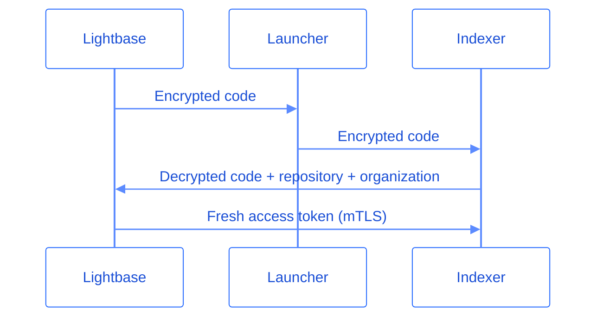

Lightbase reads your source code to build a model of your system and answer questions about it. Granting that access is a security decision, so Lightbase applies controls at every step of the process.

This page follows that process in order: the access tokens Lightbase uses and when it stores them, the isolated environments where indexing runs, how the indexer obtains a token to clone your code, how the resulting model and graph data are encrypted, and how that data is deleted when you revoke access.

## Access tokens

Lightbase uses access tokens from your connected source providers to:

- List the repositories available for that token during synchronization
- Read repository metadata such as branches and commits
- Fetch your code during indexing

How Lightbase manages these tokens depends on the source provider.

### GitLab and Bitbucket connections

GitLab and Bitbucket repositories connect to a user account through OAuth, brokered by WorkOS. WorkOS holds the authorization and manages the storage and refresh of the tokens. Lightbase stores no token, instead it requests a short-lived token from WorkOS each time it needs one.

### GitHub connections

GitHub repositories connect through a GitHub App, which links Lightbase to the organization rather than a single user account. GitHub Apps are not supported by WorkOS, so Lightbase manages the storage and refresh of these tokens itself. Lightbase stores each GitHub access token with envelope encryption, and the token has a one-hour lifetime.

## Indexing environment

To build your model, Lightbase clones each repository and analyzes its code. Each indexing run happens in its own fresh environment, and nothing carries over to the next.

- **One repository per run.** An environment only ever holds the repository it was created to analyze.
- **Ephemeral by design.** Your code exists in the environment only while the run is active.
- **Isolated.** Each environment is isolated, with no shared storage and no network path to any other. No other indexing run, organization, or outside party can reach an active environment.
- **Least privilege.** The analysis runs as an unprivileged user, not as root.
- **Untrusted code.** When Lightbase clones your code, it disables git hooks, symlink materialization, and submodule fetching, so cloning a repository cannot trigger code execution or reach outside the repository being indexed.

## Indexing process

Once the indexing environment is running, its first step is to clone the repository. It obtains the access token it needs through a one-time exchange:

1. Lightbase triggers an indexing run. It generates a one-time code for the repository, stores it, and encrypts it with your organization's key.
2. It enqueues a job for the run, carrying the encrypted code and the repository's data. The job never carries the access token.
3. When the indexing environment starts, it decrypts the code from the job and sends it back to a Lightbase endpoint over mTLS, along with the repository and organization it is indexing.
4. Lightbase matches the code against the one it stored for that repository and consumes it. On a match, it requests a fresh access token from your provider, through WorkOS or the GitHub App, and returns it to the indexer.

<Note>
  The code in the job is encrypted with your organization's key, so it cannot be used without access to that key. Each code works only once, and the exchange runs over mTLS, so a captured code cannot be replayed.
</Note>

## Model and graph data

Indexing produces the model Lightbase builds from your code, stored in two systems. A vector store holds the embeddings, code snippets, and metadata that let you and your agents query how your services connect. A graph database holds the entities in your code and the relationships between them.

Both hold sensitive information derived from your code. Lightbase encrypts this data with your organization's key and keeps it isolated to your organization.

## Data deletion

You stay in control of the data Lightbase derives from your code.

When you [disable a repository](/getting-started/repositories), remove it from your provider, or revoke Lightbase's access to it, Lightbase detects the change and deletes all model and graph data it produced for that repository. You can re-enable a repository at any time, but Lightbase indexes it from scratch, and the previous data is not restored.

Deleting your organization goes further. Lightbase destroys your organization's key, which makes any data still encrypted with it permanently unreadable.
